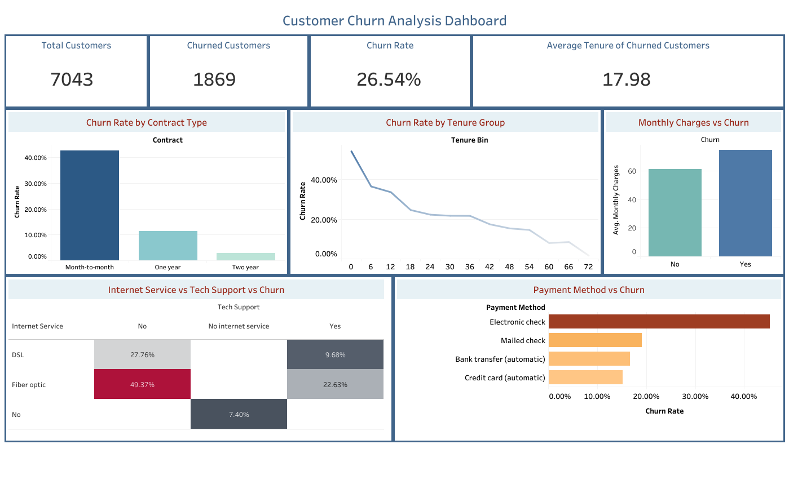
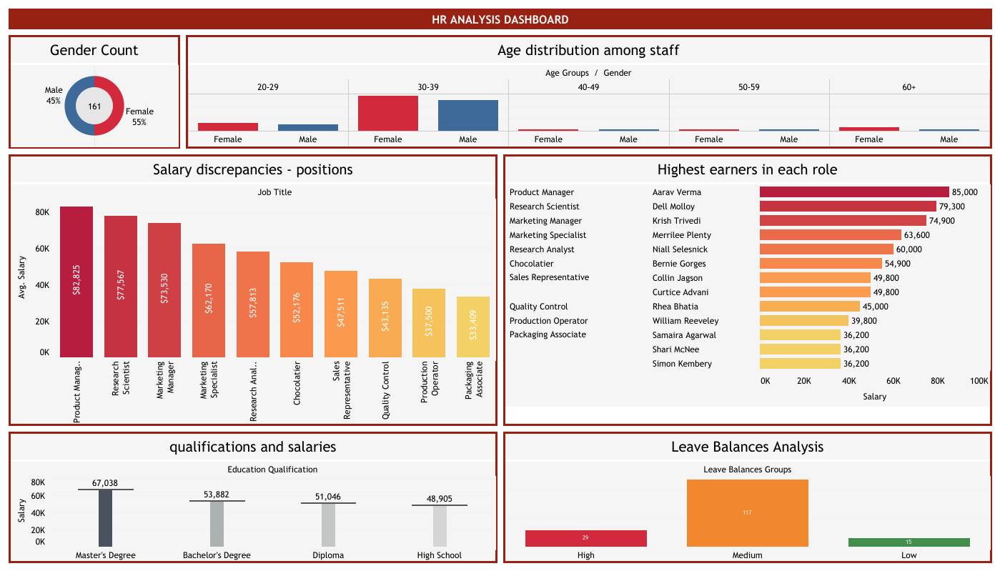
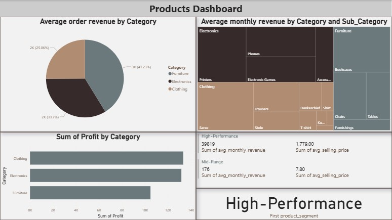

# Junior Data Analyst

## Contacts
#### Email: [omarhassoundithomsi@gmail.com](omarhassoundithomsi@gmail.com)
#### Phone: [+963-965540536](https://wa.me/963965540536)
#### Social: [LinkedIn](https://www.linkedin.com/in/omar-hassoun-dit-homsi-09bb22207/)

## Summary
I'm expert in data analysis and its applications in business and technology, leveraging data-driven insights to tackle complex business challenges.
I've solid knowledge in SQL, Excel and data visualization tools such as Tableau & Power BI, and I effectively utilize Generative AI tools to enhance analysis and decision-making to stakeholders.

## Skill Highlights
- Microsoft Excel 
- SQL Server
- Tableau & Power BI 
- Storeytelling 
- Analytical Thinking 
- Problem-Solving
- Attenttion to Details
- Teamwork & Collaboration 

## Work Experiences 
#### QA Data Quality Analyst Specialist @ FMS Tech., Abu Dhabi, UAE · Remote (Nov 2022 - Present)
- Work closely with the AI/ML engineers to develop an accurate Driver 
  Monitoring System including detecting driver's fatigue, distraction, cellphone use, and smoking.
- Collect and analyze data from various sources to identify trends, patterns, and anomalies that impact the system's detection accuracy and overall performance.
- Doing monthly check to evaluate the system performance and present information using charts, and reports to the manager and the decision makers.
- Report bugs to QA software team, and provide them with suggestions to make the portal more efficient.
- Lead a violation team, and train the new team members on the system.

#### Data Analyst Internship @ NSDIC, India · Remote (Jul 2025 – Aug 2025)
- Analyzed, visualized, & reported 3 projects using different tools & methods.
- Explain the final dashboards to the stakeholders.

## Projects:

- ### Customer Churn Analysis :
Develop a dashboard to investigate the reasons behind customer attrition within a defined timeframe to empower decision-makers in addressing customer churn effectively using Tableau Public Desktop.

[View Full Project](https://public.tableau.com/app/profile/omar.hassoun.dit.homsi/viz/ChurnAnalysis_17547512671070/CustomerChurnAnalysisDashboard)

- ### HR Data Analysis:
Create a streamlined dashboard that give HR team quick insights about employees & salaries using Tableau Public Desktop.

[View Full Project](https://public.tableau.com/app/profile/omar.hassoun.dit.homsi/viz/HRDataAnalysis_17540524077600/HRSummary)

- ###	Store Data Analysis:
Create a dashboard and share insights to track and analyze online sales across a county to make business decisions using SQL Server & Power BI.

## Education
Bachelors in Electronics and communication engineering, Damascus University. 
(Gratuated 2023, Grade: 74.51%)

## Certifications 
IBM Data Analyst Professional Certificate (Specialization) 
[View Certificate](https://www.coursera.org/account/accomplishments/specialization/4FO4PPVC6AR0)

## Languages
- English: Professional working proficiency.
- Arabic: Native. 
